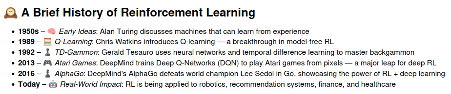
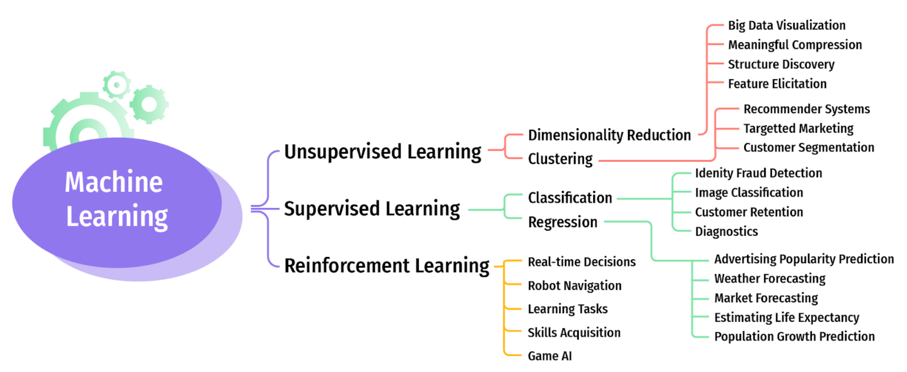
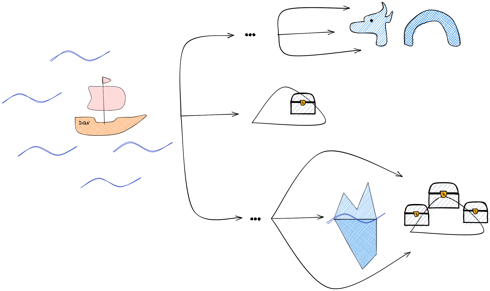
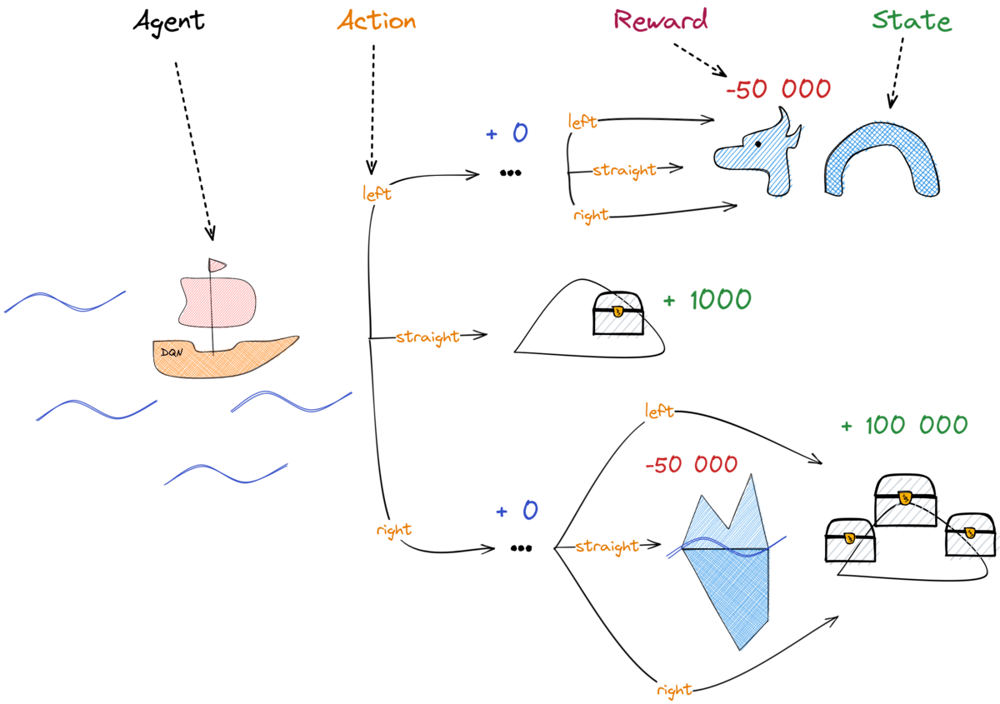
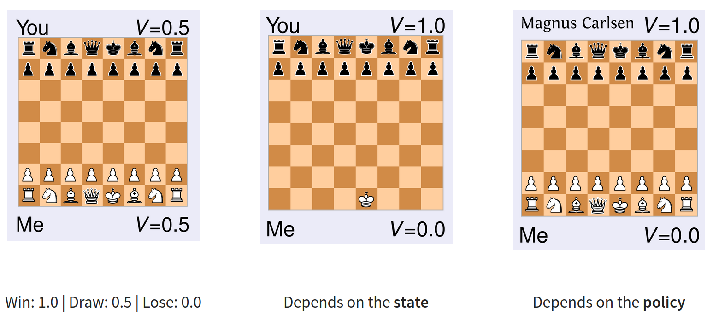
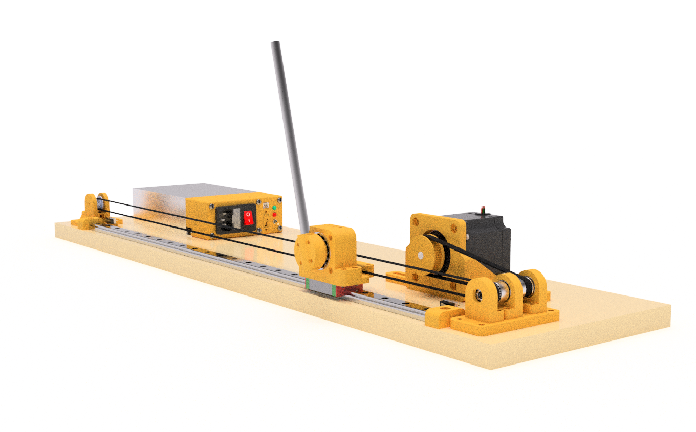

# Introduction to Reinforcement Learning

> Benjamin Bray @ 9 August 2025
>
> **Note:**  I borrowed a lot of content from Antonin Raffin's [wonderful slides](https://araffin.github.io/slides/dqn-tutorial/)!

----------

----------

----------

<!-- _footer:  (Credit:  [Antonin Raffin](https://araffin.github.io/slides/dqn-tutorial/#/4)) -->

----------
<!-- _class: section -->
<!-- footer: "Reinforcement Learning: Basics" -->

## Reinforcement Learning:  Basics

----------

## Reinforcement Learning:  Setting

A robot (**"agent"**) must survive in an unknown environment...

* It has **sensors** which collect **observations** about the **state** of the world
* It can take **actions** to move or interact with the environment
* It receives **rewards** or **penalties** based on its actions.

----------

<!-- _footer:  (Credit:  [Antonin Raffin](https://araffin.github.io/slides/dqn-tutorial/#/4)) -->

**Agent:** Boat on the high seas!

**(Observed) State:** Where are we?
  - (position, speed, ...)

**Action:** What can we do next?
  - (steer left, right, ...)

**Reward:** How well are we doing?

**Policy $(\pi)$:** The captain!
  - navigates based on observations + prior knowledge

----------

## Reinforcement Learning:  Policy

The agent follows a **policy** $\pi : \mathtt{States} \rightarrow \mathtt{Actions}$.

* (deterministic) If we are in state $s$, we should take action $\pi(s)$ next.
* (non-deterministic) $\pi(s)$ defines a _probability distribution_ over next actions.

Simple Examples:
> "If my opponent played `Rock` last turn, I will always play `Rock` next turn."

> "If I see a parked car ahead of me, I will always change lanes."

----------

## Reinforcement Learning:  Value Functions

A **value function** $V^\pi(s)$ measures _"How good is it to be in state $s$, with policy $\pi$?"_
- For some games (like chess!) we can compute $V$ from historical game data

<!-- _footer:  (Credit: Frank Stulp via [Antonin Raffin](https://araffin.github.io/slides/dqn-tutorial/#/4)) -->

----------
<!-- _class: section -->
<!-- footer: "Policy Gradients" -->

## Policy Gradient Methods

----------

## Policy Gradient:  Quick Look

Idea:

* Define a **parameterized policy** function $\pi_\theta : \mathrm{Actions} \rightarrow \mathrm{State}$
  - Parameters $\theta$ control e.g. the "shape" of robot trajectories

* Define an **expected episodic reward function** $J(\theta)$,
  $$
  J(\theta) = \mathbb{E}_{\pi_\theta}\left[ \sum_{t \in [0,T]} \gamma^t R_t \bigg\vert \mathrm{InitialState} = s_0\right]
  $$

* Use gradient ascent to find the parameters $\theta$ which maximize reward $J(\theta)$!

  $$
  \theta_{\mathrm{best}} = \arg\max_\theta J(\theta)
  $$

----------

### Example:  `CartPole`

> (read the [`CartPole` docs page](https://gymnasium.farama.org/environments/classic_control/cart_pole/), then see the [video](https://www.youtube.com/watch?v=VgG2suR_D1U))

----------
<!-- _class: section -->
<!-- footer: "Q-Learning" -->

## Q-Learning

| | |
--------------------|-----------
| Time              | $\mathrm{\color{orange}Discrete}$ |
| Action Space      | $\mathrm{\color{orange}Discrete}$ |
| Observation Space | $\mathrm{\color{orange}Discrete}$ |

----------

## Q-Learning:  Idea

What if we had a table

----------
<!-- _class: section -->
<!-- footer: "Deep Q-Learning" -->

## Deep Q-Learning

----------
<!-- _class:  section -->
<!-- footer: "Policy Gradients" -->

## Policy Gradients
